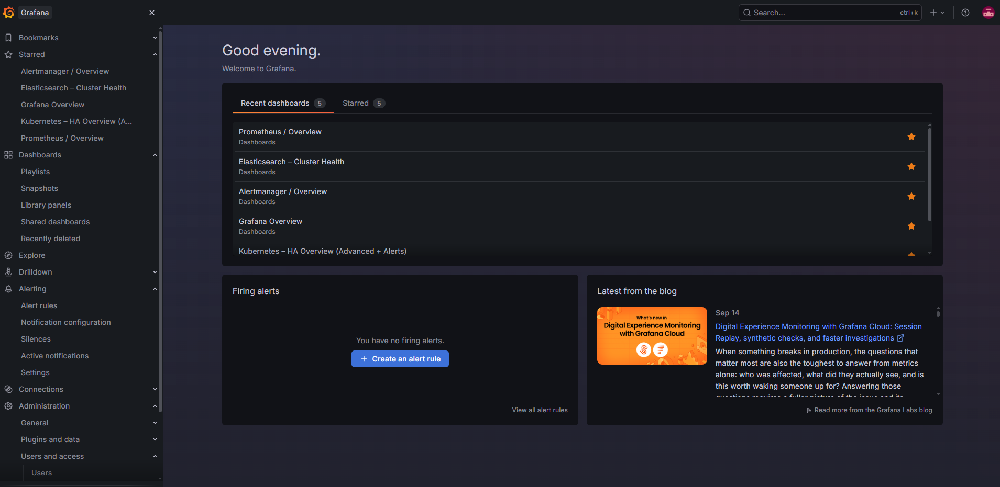
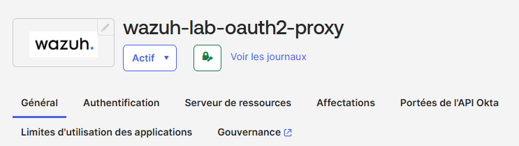
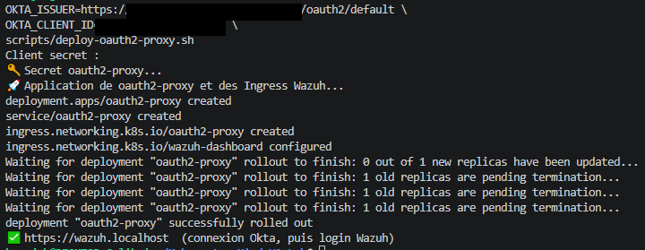

#  Kubernetes KinD HA Lab


---

### *Cluster multi‑nœuds, ingress, déploiements v1/v2, services et monitoring complet*

Ce projet met en place un environnement Kubernetes local **reproductible**, basé sur **KinD** (Kubernetes in Docker), avec :

- un **cluster HA** (1 control-plane + 2 workers)
- un **Ingress NGINX** fonctionnel
- deux versions d’une application (v1 / v2)
- un **Service** + **Ingress** pour exposer l’app
- un **stack de monitoring complet** (Prometheus, Grafana, Alertmanager) via kube‑prometheus‑stack
- **Elasticsearch** + **Metricbeat** pour la santé du cluster ES lui-même
- un **SIEM Wazuh** (manager, indexer, dashboard) déployé en single-node sur le cluster

Ce lab est conçu pour l’expérimentation et la démonstration de concepts Kubernetes dans un environnement maîtrisé.

<p align="center">
  
</p>

---

### 📑 Sommaire

1. [Architecture du projet](#️-1-architecture-du-projet)
2. [Prérequis](#-2-prérequis)
3. [Cloner le repository](#-3-cloner-le-repository-github-dans-wsl)
4. [Structure du repo](#-4-structure-du-repo)
5. [Création du cluster KinD HA](#-5-création-du-cluster-kind-ha)
6. [Installation de l'Ingress NGINX](#-6-installation-de-lingress-nginx)
7. [Déploiement des applications v1 et v2](#-7-déploiement-des-applications-v1-et-v2)
8. [Installation du monitoring](#-8-installation-du-monitoring-kubeprometheusstack)
9. [Elasticsearch et Metricbeat](#-9-installation-delasticsearch-et-metricbeat)
10. [Accès à Grafana](#-10-accès-à-grafana)
11. [Dashboard personnalisé](#️-11-dashboard-personnalisé-cluster-overview)
12. [Installation de Wazuh (SIEM)](#️-12-installation-de-wazuh-siem)
13. [Mettre le labo en pause / le reprendre](#️-13-mettre-le-labo-en-pause--le-reprendre)
14. [Nettoyage](#-14-nettoyage-du-cluster-et-des-images-docker-inutiles)

---

# 🏗️ 1. Architecture du projet

### 🔹 Cluster KinD HA
- 1 node **control-plane**
- 2 nodes **workers**
- réseau Docker interne
- Ingress exposé via NodePort

### 🔹 Applications
- `app-v1`
- `app-v2`
- Service ClusterIP
- Ingress HTTP (domaines locaux)

### 🔹 Observabilité
- **Prometheus** → collecte des métriques
- **Grafana** → visualisation
- **Alertmanager** → gestion des alertes
- **Elasticsearch**

### 🔹 SIEM
- **Wazuh manager** (master + worker) → collecte et analyse d'événements de sécurité
- **Wazuh indexer** → stockage (fork d'OpenSearch, cluster distinct de l'Elasticsearch de la section 9)
- **Wazuh dashboard** → visualisation des alertes de sécurité

---

# 🧰 2. Prérequis

- Docker Desktop  (WSL Integration -> Ubuntu activé)
- kubectl
- KinD
- Helm
- WSL Ubuntu
- `openssl` (certificat TLS et mot de passe de l'Ingress, `scripts/deploy-ingress.sh`)
- **Un fournisseur d'identité OIDC pour le SSO devant Wazuh** — ici un tenant **Okta** avec les droits
  d'administration pour y créer une application (testé avec l'offre gratuite Okta Integrator) : voir
  « SSO Okta devant le dashboard Wazuh », section 10. Il n'est utile que pour l'adresse
  `https://wazuh.localhost`. Sans Okta, tout le reste du lab fonctionne : on ouvre simplement Wazuh
  avec le `port-forward` de la section 12 (`https://127.0.0.1:8443`).
- **~7-8 Go de RAM disponibles** pour Docker Desktop une fois tout le lab démarré (3 nœuds + stack
  de monitoring + Elasticsearch + Wazuh) — voir section 13 pour mettre le lab en pause entre deux
  utilisations

---

# ♾ 3. Cloner le repository GitHub dans WSL

Les sections suivantes utilisent des fichiers de ce repo (`kind-config.yaml`, `manifests/`,
`monitoring/`...) — cloner en premier :

```bash
cd ~
git clone https://github.com/Anne-LaureS/Kubernetes-Kind-HA-Lab.git
cd Kubernetes-Kind-HA-Lab
```

---

# 📚 4. Structure du repo

```
Kubernetes-Kind-HA-Lab/
├── kind-config.yaml
├── ingress-servicemonitor.yaml
├── .gitignore
├── app/
│   ├── v1/
│   │   ├── index.html
│   │   └── Dockerfile
│   └── v2/
│       ├── index.html
│       └── Dockerfile
├── grafana/
│   ├── dashboard.json
│   ├── elasticsearch-dashboard.json
│   ├── alerts/
│   │   ├── cpu-cluster.json
│   │   ├── http-rps.json
│   │   ├── latency-p95.json
│   │   └── ram-cluster.json
│   ├── contact-points/
│   │   └── email.json
│   └── notification-policies/
│       └── default.json
├── scripts/
│   ├── deploy-grafana.sh
│   ├── deploy-ingress.sh
│   ├── deploy-oauth2-proxy.sh
│   └── deploy-wazuh.sh
├── .github/
│   └── workflows/
│       └── grafana-deploy.yml
├── monitoring/
│   ├── elasticsearch.yaml
│   ├── elasticsearch-datasource.yaml
│   └── metricbeat.yaml
├── wazuh/
│   ├── kustomization.yml
│   ├── base/
│   ├── certs/                  (générés localement, non commités)
│   ├── secrets/
│   ├── wazuh_managers/
│   └── indexer_stack/
├── ingress-certs/          (certificat TLS de l'Ingress, généré localement, non commité)
├── wazuh-envs/
│   └── kind-env/
│       ├── kustomization.yml
│       ├── storage-class.yaml
│       ├── indexer-resources.yaml
│       └── wazuh-resources.yaml
├── manifests/
│   ├── configmap-v1.yaml
│   ├── configmap-v2.yaml
│   ├── demo-v1.yaml
│   ├── demo-v2.yaml
│   ├── hpa-demo-v1.yaml
│   ├── hpa-v2.yaml
│   ├── ingress.yaml
│   ├── ingress-services.yaml
│   └── oauth2-proxy.yaml
├── screenshots/
│   ├── dashboard.png
│   ├── alert-rule.png
│   ├── elasticsearch.png
│   ├── wazuh-dashboard.png
│   ├── grafana-home.png
│   ├── okta-app.png
│   └── okta-deploy.png
└── README.md
```

---

# 🚀 5. Création du cluster KinD HA

Le fichier `kind-config.yaml` définit un cluster multi‑nœuds.

Créer le cluster :

```bash
kind create cluster --config kind-config.yaml
```

Vérifier :

```bash
kubectl get nodes
```

---

# 🌐 6. Installation de l’Ingress NGINX

```bash
kubectl apply -f https://raw.githubusercontent.com/kubernetes/ingress-nginx/main/deploy/static/provider/kind/deploy.yaml
```

Vérification :

```bash
kubectl get pods -n ingress-nginx
kubectl get svc -n ingress-nginx
```

Ce manifeste n'active pas les métriques Prometheus par défaut. Pour que les panels "Latence Ingress
P95" / "Requêtes HTTP (RPS)" du dashboard Grafana affichent des données, il faut les activer et
appliquer le `ServiceMonitor` du repo :

```bash
kubectl -n ingress-nginx patch deployment ingress-nginx-controller --type=json -p='[
  {"op": "add", "path": "/spec/template/spec/containers/0/args/-", "value": "--enable-metrics=true"},
  {"op": "add", "path": "/spec/template/spec/containers/0/ports/-", "value": {"name": "metrics", "containerPort": 10254, "protocol": "TCP"}}
]'
kubectl -n ingress-nginx patch service ingress-nginx-controller --type=json -p='[
  {"op": "add", "path": "/spec/ports/-", "value": {"name": "metrics", "port": 10254, "targetPort": "metrics", "protocol": "TCP"}}
]'
```

ℹ️ Le `ServiceMonitor` lui-même (`ingress-servicemonitor.yaml`) s'applique **après** la section 8 —
son CRD (`monitoring.coreos.com/v1`) est fourni par `kube-prometheus-stack`, pas encore installé à ce
stade. L'appliquer maintenant échoue avec `no matches for kind "ServiceMonitor"`.

⚠️ Le manifeste "kind" ne fixe pas le pod du contrôleur sur le nœud `control-plane` — or c'est le seul
nœud sur lequel `kind-config.yaml` mappe les ports hôte `8080`/`443`. Après un redémarrage/rollout, le
pod peut être replanifié sur un worker et rendre `http://127.0.0.1:8080` inaccessible
(`Connection reset by peer`). Fixer explicitement le nœud :

```bash
kubectl -n ingress-nginx patch deployment ingress-nginx-controller --type=json -p='[
  {"op": "add", "path": "/spec/template/spec/nodeSelector/kubernetes.io~1hostname", "value": "kind-control-plane"}
]'
```

---

# 📦 7. Déploiement des applications v1 et v2

```bash
docker build -t demo:v1 app/v1
kind load docker-image demo:v1 --name kind
kubectl label node kind-control-plane ingress-ready=true
kubectl apply -f manifests/demo-v1.yaml
kubectl get pods -l app=demo-v1

docker build -t demo:v2 app/v2
kind load docker-image demo:v2 --name kind
kubectl apply -f manifests/demo-v2.yaml

kubectl apply -f manifests/ingress.yaml
kubectl apply -f manifests/hpa-demo-v1.yaml
```

---

# 📊 8. Installation du monitoring (kube‑prometheus‑stack)

Ajouter le repo Helm :

```bash
sudo snap install helm --classic
helm repo add prometheus-community https://prometheus-community.github.io/helm-charts
helm repo add grafana https://grafana.github.io/helm-charts
helm repo update
```

Installer le stack — **le nom de release doit être `monitoring`** (les sections suivantes, et
notamment `svc/monitoring-grafana` en section 10, en dépendent) :

```bash
helm install monitoring prometheus-community/kube-prometheus-stack -n monitoring --create-namespace
```

Vérifier :

```bash
kubectl -n monitoring get pods
```

Une fois tous les pods `Running`, appliquer le `ServiceMonitor` de l'ingress (voir note section 6) :

```bash
kubectl apply -f ingress-servicemonitor.yaml
```

---

# 🔎 9. Installation d'Elasticsearch et Metricbeat

```bash
kubectl apply -f monitoring/elasticsearch.yaml
kubectl apply -f monitoring/metricbeat.yaml
```

Vérifier :

```bash
kubectl -n monitoring get pods -l app=elasticsearch
kubectl -n elastic get pods
```

Metricbeat surveille Elasticsearch lui-même (santé cluster, JVM, index) et renvoie ces métriques dans
Elasticsearch — mais sans source de données Grafana dédiée, ces données restent invisibles. Ajouter la
datasource :

```bash
kubectl apply -f monitoring/elasticsearch-datasource.yaml
```

⚠️ Ne pas fixer de `uid` explicite sur cette datasource dans le manifeste — un `uid` correspondant au nom
du type (`elasticsearch`) fait échouer le provisioning Grafana (`Datasource provisioning error: data
source not found`). Laisser Grafana en générer un automatiquement.

Le dashboard **"Elasticsearch – Cluster Health"** (`grafana/elasticsearch-dashboard.json`, importé par
`deploy-grafana.sh`) affiche : documents et taille de l'index au niveau cluster, utilisation JVM heap et
CPU du nœud.

<p align="center">
  
</p>

### 🔹 Accès direct à l'API Elasticsearch

En plus du dashboard Grafana ci-dessus, l'API REST d'Elasticsearch est interrogeable directement via
port-forward — utile pour une vérification rapide sans passer par Grafana :

```bash
kubectl -n monitoring port-forward --address 127.0.0.1 svc/elasticsearch 9200:9200
```

Puis :

```bash
curl http://127.0.0.1:9200/_cluster/health?pretty   # santé du cluster
curl http://127.0.0.1:9200/_cat/indices?v           # liste des index et leur taille
```

⚠️ La sécurité d'Elasticsearch est **désactivée** dans ce lab (`xpack.security.enabled: "false"` dans
`monitoring/elasticsearch.yaml`) : l'API n'exige aucun mot de passe et permet de lire comme de
supprimer des index. Garder ce tunnel sur `127.0.0.1` — ne pas utiliser `--address 0.0.0.0` pour
celui-ci. Si le navigateur Windows n'y accède pas, voir la vérification des ports réservés en
section 10.

Le statut `yellow` est normal et attendu ici — un cluster à un seul nœud ne peut jamais assigner ses
shards de réplique (qui nécessitent un second nœud), `green` n'est donc pas atteignable dans cette
configuration.

---

# 📈 10. Accès à Grafana

Le port hôte `8080` est déjà réservé par `kind-config.yaml` pour l'ingress (voir section 5) — utiliser
un autre port local pour Grafana, par exemple `8081` :

```bash
kubectl -n monitoring port-forward --address 127.0.0.1 svc/monitoring-grafana 8081:80
curl http://127.0.0.1:8081
```

⚠️ **Sous WSL + VS Code (Remote-WSL)** : `http://127.0.0.1:8081` peut rester inaccessible depuis le
navigateur Windows (`ERR_CONNECTION_REFUSED`) même si `curl` réussit *depuis WSL* et que le port
apparaît "vert" dans l'onglet **PORTS** de VS Code. **Première vérification :** le port local
n'est-il pas dans une plage **réservée par Windows** ? Le relais localhost WSL→Windows ne peut pas
ouvrir un port réservé. Ces plages sont réattribuées par Windows au fil des démarrages :

```powershell
netsh interface ipv4 show excludedportrange protocol=tcp
```

Si le port figure dans une plage (par exemple `8443` peut tomber dans `8399–8498`), en choisir un
autre hors de toutes les plages — ex. `10443:443` pour Wazuh, voir section 12 — et adapter l'URL.

**Solution de repli** si le port est libre mais que le relais ne suit toujours pas un port-forward
lancé en arrière-plan :

```bash
# 1. Relancer le port-forward en écoutant sur toutes les interfaces, pas juste 127.0.0.1
kubectl -n monitoring port-forward --address 0.0.0.0 svc/monitoring-grafana 8081:80

# 2. Récupérer l'IP de la VM WSL (change à CHAQUE redémarrage de WSL, donc à revérifier à chaque
#    session — ne jamais la coder en dur, cf. le piège équivalent avec l'IP EC2 en TP7)
hostname -I
```

Puis ouvrir `http://<IP-WSL>:8081` (ex. `http://172.24.188.82:8081`) depuis le navigateur Windows.
⚠️ Ceci écoute sur toutes les interfaces du VM WSL, pas seulement en local. Selon le mode réseau de
WSL2 (en NAT, l'IP WSL n'est en principe joignable que depuis la machine hôte), d'autres appareils
peuvent y accéder tant que le port-forward tourne — à ne faire que temporairement, et à arrêter
(`Ctrl+C` / `kill`) une fois la vérification terminée. À éviter pour Elasticsearch (sans
authentification, section 9) et pour Wazuh tant que ses identifiants de démonstration n'ont pas été
changés (section 12).

Identifiants par défaut :

- User : **admin**
- Password :
  ```bash
  kubectl -n monitoring get secret monitoring-grafana -o jsonpath="{.data.admin-password}" | base64 -d ; echo
  ```

<p align="center">
  
</p>

### 🔒 Accès par Ingress (HTTPS + authentification)

Alternative aux `port-forward` (qui tombent dès que la session ou le pod change) : Grafana, Wazuh et
Elasticsearch sont exposés derrière l'ingress-nginx du lab, en HTTPS.

```bash
./scripts/deploy-ingress.sh
```

| Service | URL | Protection |
|---|---|---|
| Grafana | `https://grafana.localhost` | login Grafana |
| Wazuh | `https://wazuh.localhost` | SSO Okta (oauth2-proxy), puis login Wazuh |
| Elasticsearch | `https://es.localhost` | authentification basique |

- Le script génère un certificat TLS auto-signé (`ingress-certs/`, non commité — avertissement
  navigateur attendu) et un mot de passe aléatoire pour l'authentification basique (identifiant
  `labuser`), **affiché une seule fois** : seul son hash est stocké dans le cluster (Secret
  `ingress-basic-auth`). `./scripts/deploy-ingress.sh --rotate` en génère un nouveau.
- Les noms `*.localhost` sont résolus vers la machine locale par les navigateurs, sans modifier le
  fichier `hosts`. Ils passent par le port `443` publié par `kind-config.yaml` ; `http://` (port
  `8080`) redirige vers HTTPS.
- L'authentification basique protège Elasticsearch (sans sécurité native dans ce lab). Elle convient à
  une API, pas à une interface web qui gère sa propre session : Wazuh est donc protégé par un SSO à
  cookie (Okta, voir ci-dessous) et Grafana garde son propre login.
- ⚠️ Par défaut, kind publie les ports du nœud sur toutes les interfaces de la machine (`0.0.0.0`) :
  `kind-config.yaml` les restreint à `127.0.0.1` pour tout cluster créé à partir de ce fichier.

### 🔐 SSO Okta devant le dashboard Wazuh

Le dashboard Wazuh n'a que des identifiants de démonstration (section 12) : `oauth2-proxy` et
l'ingress-nginx (`auth-url`) exigent d'abord une connexion Okta (identifiant, second facteur, mot de
passe) avant de laisser passer la moindre requête. Le login Wazuh reste ensuite, derrière.

```
navigateur → Ingress + oauth2-proxy (Okta, OIDC) → login Wazuh → dashboard
```

**1. Application Okta** (Applications → *Create App Integration* → **OIDC** → **Web Application**) :

- Grant type : *Authorization Code*
- Sign-in redirect URI : `https://wazuh.localhost/oauth2/callback`
- Cocher **Exiger PKCE** (oauth2-proxy envoie déjà un PKCE `S256`).
- Laisser **Federation Broker Mode désactivé** (sinon tous les utilisateurs du tenant sont autorisés)
  et affecter uniquement les comptes autorisés à ouvrir Wazuh (onglet *Affectations*).

<p align="center">
  
</p>

**2. Déploiement** (après `deploy-ingress.sh`) :

```bash
OKTA_ISSUER=https://<ton-tenant>.okta.com \
OKTA_CLIENT_ID=<client-id> \
./scripts/deploy-oauth2-proxy.sh
```

Le client secret est demandé sans écho ; il est stocké uniquement dans un Secret Kubernetes
(`oauth2-proxy`), jamais dans un fichier. L'issuer est celui du serveur d'autorisation de
l'organisation Okta, qui ne demande aucune politique d'accès supplémentaire.

<p align="center">
  
</p>

- La session dure **3 heures** (`--cookie-expire=3h` dans `manifests/oauth2-proxy.yaml`) ; au-delà,
  Okta est de nouveau sollicité (ses propres facteurs ne sont redemandés que selon la politique
  d'authentification de l'application Okta).
- Pour repartir sans session et revoir la connexion Okta : `https://wazuh.localhost/oauth2/sign_out`
  ou une fenêtre privée.
- Observé avec **Brave** en navigation privée : au premier retour d'Okta, le navigateur peut ne pas
  renvoyer le cookie de départ et oauth2-proxy répond `403 … Unable to find a valid CSRF token`.
  Cliquer sur *Connexion* suffit ; le parcours complet passe directement avec Edge.

### 🔹 Dashboards inclus automatiquement

- Kubernetes / Compute Resources
- Kubernetes / Networking
- Node Exporter
- Prometheus Overview
- Grafana Overview

---

# 🛠️ 11. Dashboard personnalisé (Cluster Overview)

> Une fois importé (voir "Automatiser les dashboards" ci-dessous), il apparaît dans Grafana sous le
> titre **"Kubernetes – HA Overview (advanced + alerts)"** (uid `k8s_ha_overview`) — pas littéralement
> "Cluster Overview", qui n'est que le nom descriptif utilisé dans ce README. Accès direct :
> `http://127.0.0.1:8081/d/k8s_ha_overview`.

Il inclut :

- CPU cluster
- RAM cluster
- CPU par node
- RAM par node
- Pods par node
- Latence Ingress P95
- Requêtes HTTP

<p align="center">
  
</p>
<p align="center"><i>Règles d'alerte actives (dont les 4 règles custom du repo, section suivante) avec leur état en direct.</i></p>

### 🔹 Automatiser les dashboards

Fichiers concernés : `grafana/` (dashboards, alertes, contact points, notification policies),
`scripts/deploy-grafana.sh` et `.github/workflows/grafana-deploy.yml` — voir l'arborescence complète en
section 4.

Pour déployer le script Bash afin d'automatiser les dashboards (nécessite une clé API Grafana et une
adresse email de notification — `contact-points/email.json` utilise `${ALERT_EMAIL}`) :
```bash
chmod +x scripts/deploy-grafana.sh
export GRAFANA_URL="http://127.0.0.1:8081"   # doit correspondre au port du port-forward (section 10)
export API_KEY="ta-cle-api-grafana"
export ALERT_EMAIL="ton-email@exemple.com"
./scripts/deploy-grafana.sh
```

La clé API s'obtient dans Grafana → **Administration → Users and access → Service accounts** →
*Add service account* (rôle Admin) → *Add service account token*.

⚠️ Les 4 règles d'alerte (`grafana/alerts/*.json`) pointent vers un dossier `cluster-alerts` (`Cluster
Alerts`) que le script crée automatiquement avant de les provisionner. Ne pas repointer ces règles vers
le dossier `"general"` : c'est un UID réservé par Grafana (impossible d'y créer un vrai objet dossier),
et l'API `ruler` refuse alors l'accès en lecture (`403 access denied to folder`) — bug rencontré et
corrigé une première fois sur ce repo, silencieux tant que personne n'ouvre la page des règles. De même,
le champ de seuil des expressions `type: threshold` doit être `"conditions": [{"evaluator": {"type":
"gt", "params": [...]}}]` — l'ancien format `"thresholds": [{"value": ..., "color": ...}]` est accepté
à la création (aucune erreur du provisioning) mais fait échouer l'évaluation en silence au runtime
(`[sse.parseError] failed to parse expression [C]: threshold expression requires exactly one
condition` dans les logs du pod `monitoring-grafana`).

---

# 🛡️ 12. Installation de Wazuh (SIEM)

Wazuh apporte un SIEM (détection d'événements de sécurité, FIM, analyse de logs) en complément du
stack d'observabilité des sections précédentes. Il tourne dans son propre namespace (`wazuh`) et son
propre cluster d'indexation (**wazuh-indexer**, un fork d'OpenSearch) — indépendant de
l'Elasticsearch de la section 9, ils ne partagent aucune donnée.

Les manifests sont vendorisés depuis le dépôt officiel
[wazuh/wazuh-kubernetes](https://github.com/wazuh/wazuh-kubernetes) (tag `v4.14.7`) dans `wazuh/`.
`wazuh-envs/kind-env/` est un overlay Kustomize ajouté pour ce lab : il remplace le provisioner de
stockage par `rancher.io/local-path` (celui déjà présent sur KinD, à la place de
`microk8s.io/hostpath` utilisé par l'overlay officiel `local-env`) et réduit l'empreinte à 1 réplique
par composant (indexer, manager worker) — suffisant pour une démo single-node et beaucoup plus léger
que le déploiement HA par défaut (3 indexers + 2 workers).

⚠️ Les certificats TLS (`wazuh/certs/`) ne sont **pas commités** — ce sont des clés privées générées
localement à partir des scripts `generate_certs.sh` fournis par Wazuh. Le script de déploiement les
génère automatiquement s'ils sont absents.

```bash
chmod +x scripts/deploy-wazuh.sh
./scripts/deploy-wazuh.sh
```

Le script génère les certificats, applique l'overlay (`kubectl apply -k wazuh-envs/kind-env`) et
attend que les 4 pods (indexer, manager master, manager worker, dashboard) soient prêts — compter
plusieurs minutes, le démarrage de l'indexer (JVM OpenSearch) est le plus long.

Vérifier :

```bash
kubectl -n wazuh get pods
```

### 🔹 Accès au dashboard

```bash
kubectl -n wazuh port-forward --address 127.0.0.1 svc/dashboard 8443:443
```

Ouvrir `https://127.0.0.1:8443` (avertissement certificat auto-signé attendu, à accepter).

⚠️ Si le navigateur Windows renvoie `ERR_CONNECTION_REFUSED` malgré un port-forward actif — problème
courant sous WSL + VS Code — le port `8443` est peut-être dans une plage réservée par Windows :
vérifier avec la commande `netsh` de la section 10 et, si besoin, utiliser un autre port local :

```bash
kubectl -n wazuh port-forward --address 127.0.0.1 svc/dashboard 10443:443
```

puis ouvrir `https://127.0.0.1:10443`. La solution de repli (`--address 0.0.0.0` + IP WSL) reste
détaillée en section 10, mais est déconseillée ici tant que les identifiants de démonstration
ci-dessous n'ont pas été changés.

Identifiants par défaut (démo officielle Wazuh, communs indexer + dashboard) :

- User : **admin**
- Password : **SecretPassword**

⚠️ Ce sont les identifiants de démonstration publiés tels quels dans le dépôt officiel
`wazuh-kubernetes` (`wazuh/secrets/`) — à changer avant toute exposition au-delà de ce lab local (via
`wazuh/secrets/indexer-cred-secret.yaml` et `wazuh/wazuh_managers/wazuh_conf/` pour l'API manager).
Via l'Ingress (`https://wazuh.localhost`, section 10), une connexion Okta est exigée avant d'atteindre ce login.

<p align="center">
  
</p>

### 🔹 Limitation connue : statut "Offline" sur la page Server APIs

Le badge de statut peut afficher **Offline** dans l'onglet *Server APIs* du dashboard alors que
l'API du manager répond correctement. Cause : sous une pile réseau virtualisée chargée (WSL2 +
Docker Desktop + KinD), le premier appel du dashboard vers l'API du manager (port `55000`) subit
occasionnellement des ré-essais TLS avant d'aboutir, ce qui peut prendre 20 à 30 secondes — largement
au-delà du délai que l'interface attend avant d'afficher Offline (~8 s). L'appel finit par réussir
côté backend (confirmé dans `kubectl -n wazuh logs deploy/wazuh-dashboard`, requêtes `check-api` en
`200` après ce délai) ; ce n'est donc pas un défaut de configuration ni un problème de credentials,
juste un décalage de timeout côté interface sous ces contraintes réseau. Sans impact sur les données
déjà indexées (alertes, FIM, etc.), uniquement sur ce badge de statut.

---

# ⏸️ 13. Mettre le labo en pause / le reprendre

Le cluster (control-plane + 2 workers + registry mirror) consomme plusieurs Go de RAM en continu.
S'il n'est pas utilisé, on peut le stopper sans rien perdre (config, dashboards, données) — les
conteneurs Docker sont juste arrêtés, pas supprimés :

```bash
# Mettre en pause (libère la RAM)
docker stop kind-worker kind-worker2 kind-control-plane kind-cloud-provider kind-registry-mirror

# Reprendre plus tard, état identique
docker start kind-worker kind-worker2 kind-control-plane kind-cloud-provider kind-registry-mirror
```

⚠️ Si le réseau Docker `kind` a été supprimé entre-temps (ex: `docker network prune`), ce redémarrage
échoue avec `network ... not found` — irrécupérable. Dans ce cas, repartir de la section 5
(`kind delete cluster` puis `kind create cluster`).

---

# 🧹 14. Nettoyage du cluster et des images Docker inutiles

Contrairement à la pause ci-dessus, ceci **supprime définitivement** le cluster et son état :

```bash
kind delete cluster --name kind
docker system prune -af
```
